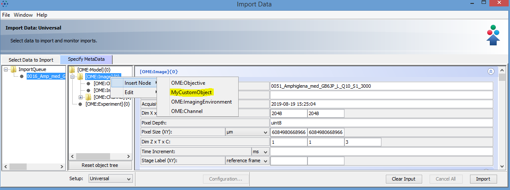
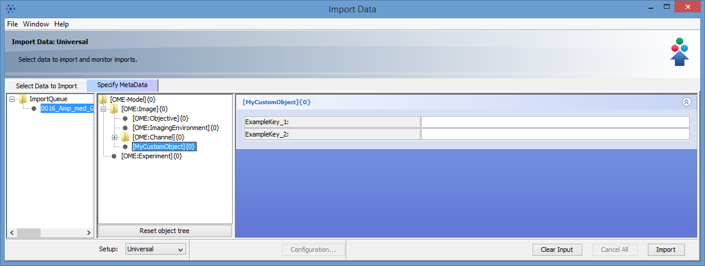
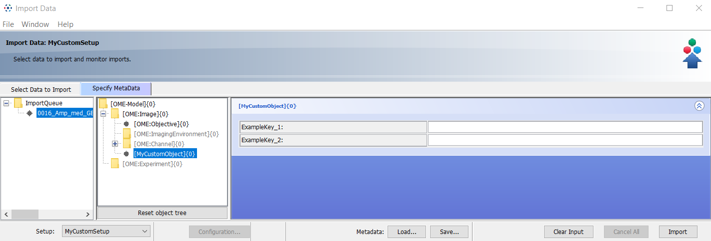

Add custom objects to OMERO.mde
===============================

**Description**
---------------

By using OMERO.mde you can create standardized key-value input forms with certain values and units. You can group key-values by creating an object module with the key-values as properties. We will show in this section how to create new objects for OMERO.mde and how you could create new key-values as properties of objects.

**Step-by-Step**
----------------

#. Open the ``mdeConfiguration.xml`` file under ``config/``.

#. Insert a new ``<ObjectDef>`` element under ``<Definitions>`` and specify the name for the object (here MyCustomObject)::

            <MDEObjects>
                <Definitions>
                    <ObjectDef Type="MyCustomObject"/>
                </Definitions>
                <Configurations.../>
            </MDEObjects>

#. Define now the properties (key-values) for your new object. For every property you have to add an ``<TagData>`` element. See below section Type of input fields.
   
#. Define now in which hierarchy the object should be insert. For that define the parent element::

        <MDEObjects>
            <Definitions>
                <ObjectDef Type="MyCustomObject">
                    <TagData.../>
                    ...
                    <Parents.../>
                </ObjectDef>
            </Definitions>
            <Configurations.../>
        </MDEObjects>

At this point we have specified an insertable object. You can insert this object with right-click on the specified parent node.
If you want this object will be automatically inserted to the object tree, you have to specify this also in the *SetupConf* section of the corresponding setup::

        <MDEObjects>
            <Configurations>
                <SetupConf Name="MyCustomSetup"
                    <ObjectConf Type="OME:Image" ...>
                    <ObjectConf Type="OME:Objective"...>
                    <ObjectConf Type="MyCustomObject" Insert="true" InsertPoint="OME:Image" ...>
                </SetupConf>
            </Configurations>
        </MDEObjects>

Example
^^^^^^^
Specification like::

                <MDEConfiguration>
                    <MDEPredefinitions...>
                    <MDEObjects>
                        <Definitions>
                            ...
                            <ObjectDef Type="MyCustomObject">
                                <TagData DefaultValues="" Name="ExampleKey_1" Type="TextField"
                                            Unit="" Value="" Visible="true" />
                                <TagData DefaultValues="" Name="ExampleKey_2" Type="TextField"
                                            Unit="" Value="" Visible="true" />
                                <Parents Values="OME:Image" />
                            </ObjectDef>
                        </Definitions>
                        <Configuration.../>
                     </MDEObjects>
                </MDEConfiguration>

will create an insertable object at ``OME:Image`` object.

|mde_customObj|

that has input form for two specified key-value pairs

|mde_customObj2|

With the additional specification in *Configuration*::

    <MDEConfiguration>
        <MDEPredefinitions...>
        <MDEObjects>
            <Definitions>
                ...
                <ObjectDef Type="MyCustomObject">
                    <TagData DefaultValues="" Name="ExampleKey_1" Type="TextField"
                                Unit="" Value="" Visible="true" />
                    <TagData DefaultValues="" Name="ExampleKey_2" Type="TextField"
                                Unit="" Value="" Visible="true" />
                    <Parents Values="OME:Image" />
                </ObjectDef>
            </Definitions>
            <Configuration>
                <SetupConf Name="MyCustomSetup">
                    <ObjectConf Type="OME:Image"...>
                    <ObjectConf Type="OME:Objective"/>
                    <ObjectConf Type="MyCustomObject" Insert="true" InsertPoint="OME:Image"/>
                </SetupConf>
            </Configurations>
         </MDEObjects>
    </MDEConfiguration>

will lead into following object tree if you select the setup *MyCustomSetup*

|mde_customObj3|
   
**Type of input fields**
------------------------

There are different editor input field types for the element ``<TagData>``. You can find this example by using the example ``mdeConfiguration.xml``
and insert a *Available InputFields* object by right-clicking on OME-Model node.

|mde_availableInputFields|

You can specify the different types like:

 `TextField` define like::
  
                <TagData DefaultValues=""
                        Name="Tag of Type TextField"
                        Type="TextField"
                        Unit=""
                        Value=""
                        Visible="true" />

 `TextField with unit` define like::

                <TagData DefaultValues=""
                        Name="Tag of Type TextField with unit"
                        Type="TextField"
                        Unit="nm"
                        Value=""
                        Visible="true" />

 `TextArea` define like::

      <TagData DefaultValues=""
                Name="Tag of Type TextArea"
                Type="TextArea"
                Unit=""
                Value=""
                Visible="true" />

 `ArrayField` define like (for an array of 2 elements)::

    <TagData DefaultValues="2"
              Name="Tag of Type ArrayField"
              Type="ArrayField"
              Unit=""
	      Value=""
              Visible="true" />

 `ArrayField` with unit define like (for an array of 3 elements)::

    <TagData DefaultValues="3"
              Name="Tag of Type ArrayField with unit"
              Type="ArrayField"
              Unit="s"
	      Value=""
              Visible="true" />

 `ComboBox` define like::

    <TagData DefaultValues="Value1,Value2,Value3"
    	      Name="tag of Type ComboBox"
              Type="ComboBox"
              Unit=""
              Value=""
              Visible="true" />

 `TimeStamp` define like::

    <TagData DefaultValues=""
              Name="Tag of Type TimeStamp"
              Type="TimeStamp"
              Unit=""
              Value=""
              Visible="true" />

.. |mde_availableInputFields| image:: images/mde_availableInputFields.PNG

