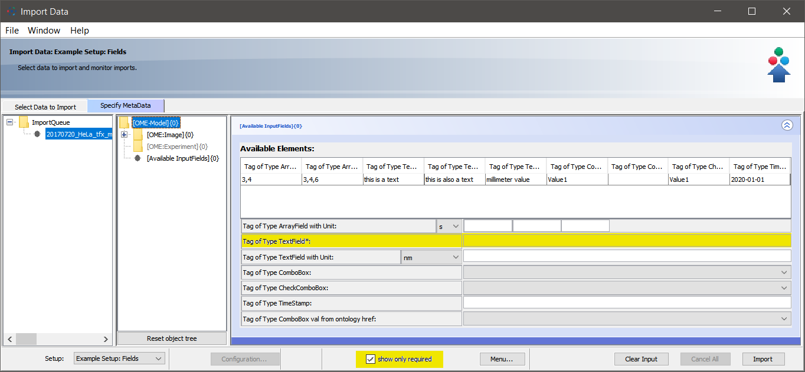

Customize user input form of OMERO.mde
======================================

Description
-----------

You can generate a filter view of the sets of objects. Also you can hide properties for objects and change the default unit.
You can mark fields as required to restrict your input forms to objects with required metadata (OMERO.insight version >= |insight_version|).
We will show in this section how to create a new setup and how to generate customized input forms of available objects in this setup.

Step-by-Step
------------

#. Open the ``mdeConfiguration.xml`` file under ``config/``.

#. Insert a new ``<SetupConf>`` element under ``<Configuration>`` and specify the name for the setup (here MyCustomSetup)::

            <MDEObjects>
                <Configurations>
                    <SetupConf Name="MyCustomSetup"/>
                </Configurations>
            </MDEObjects>

#. Define now the object elements ``<ObjectConf>`` that should be enabled (OME standard objects) or visible/choosable (other). Please pay attention of the hierarchy (the parent of and object has also to be defined here). If an object is not mentioned, it is disabled and also all child objects (OME standard objects) or not visible (defined custom objects):: 
 
            <MDEObjects>
                <Configurations>
                    <SetupConf Name="MyCustomSetup">
                        <ObjectConf Type="OME:Image"/>
                        <ObjectConf Type="OME:Objective"/>
                    </SetupConf>
                </Configurations>
            </MDEObjects>
   
   For this objects also add ``<TagDataProp>`` elements for the properties where you want to change the unit or you want to hide this property::

            <MDEObjects>
                <Configurations>
                    <SetupConf Name="MyCustomSetup">
                        <ObjectConf Type="OME:Image"/>
                            <TagDataProp Name ="Description" Unit ="" Visible ="false"/>
                        <ObjectConf Type="OME:Objective"/>
                    </SetupConf>
                </Configurations>
            </MDEObjects>

#. Save the file and restart OMERO.importer to load the new configuration for OMERO.mde. Select your images or dataset for import. Switch to the OMERO.mde pane and select your setup to load your customize forms.

**Setup:** Universal 

|mde_customizeView_Universal|

**Setup:** MyCustomSetup

|mde_customizeView_Customize|

You can mark any field as required by adding ``Required = "true"`` as an attribute of ``TagDataProp`` (OMERO.insight version >= |insight_version|).
By selecting |mde_required_btn|, you can restrict the displayed objects of the selected setup to those that contain at least one required metadata field::

            <MDEObjects>
                <Configurations>
                    <SetupConf Name="Example Setup: Fields">
                        <ObjectConf Type="OME:Image"/>
                            <TagDataProp Name="Name" Unit ="" Visible ="true" Required="true"/>
                        <ObjectConf Type="OME:Objective"/>
                    </SetupConf>
                </Configurations>
            </MDEObjects>

**Setup:** Example Setup: Fields

|mde_customizeView_RequiredFields|

.. |mde_customizeView_Universal| image:: images/mde_customView_Universal.png
.. |mde_customizeView_Customize| image:: images/mde_customView_Customize.PNG

