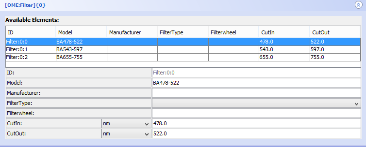
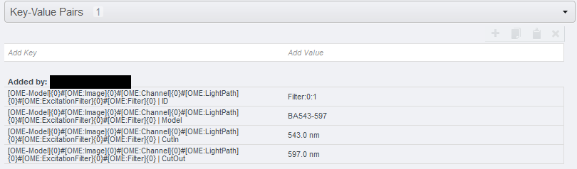

**Using OMERO.mde to edit ome metadata**
==========================================

**Description**
------------------
We will show:

- How to enable OMERO.mde feature for the OMERO.importer

- How to edit ome metadata

- How to modify the object tree

**Setup**
----------------------
Install the OMERO.insight client as described in https://omero-guides.readthedocs.io/en/latest/upload/docs/import-desktop-client.html#setup

Go to *OMERO.insight/config/* and edit *container.xml* and *containerImporter.xml*. To enable the OMERO.mde set boolean to ``true`` in::

        <!-- mde on/off -->

        <entry name="omero.client.import.mde.enabled" type="boolean">false</entry>

and save the files. 

**Step-by-Step**
--------------------------
#. Start OMERO.importer and login. 
  
#. Select your files for import and add it to the queue.

#. Click on the MDE Button |mde_button1| at the right bottom pane.

   |mde_overview|

   On the left pane you find the import queue, on the middle pane the object tree and on the right pane the input forms.

#. In the ``Specify MetaData`` window, select a file to show available metadata stored in the file container. After reading the metadata of the file by Bio-Formats
   you can find in the middle pane the object tree with standard OME objects like Image, Experiment, Detector etc. 
   The properties of the selected object in the object tree and its subtree are displayed on the right pane as key-value pairs.
   For instrument objects there is a table with all objects of the same type as ``available Elements`` as defined in the file container.

   |mde_filterExample|

Now you can editing the properties of the object.

You can:

- change the unit

- add or change the value or select another value from the list of possible values

- replace all properties of an instrument object by selecting an element from the ``available Element`` list

**Modifying the object tree** 

Add an additional object in the object tree:

#. Click with the right mouse button on the object for which a child object should be created.

#. Select an object from list under ``Insert Node`` to insert an object.

|mde_objecttree|

Copy and paste of a subtree:

#. Click with the right mouse button on the root of the subtree you want to copy.

#. Select ``Edit > Copy`` to copy this subtree.

#. Select the object where you want to insert the subtree ( you can only insert the subtree where this type of rootobject is allowed as a child)
   and select by right mouse click ``Edit > Paste``. Only the structure of the subtree will be inserted, not the values of the properties.

To reset to original object tree based on file information press the ``Reset object tree`` button.
To reset all object and properties changes press the ``Clear Input`` button.

If you edit the properties and object for a folder, all files in the folder inherit the changes.

All changes will be add as key-value annotation to the file after import.

|mde_annotation|

.. |mde_overview| image:: images/mde_overview.png

.. |mde_objecttree| image:: images/mde_objecttree.png       
