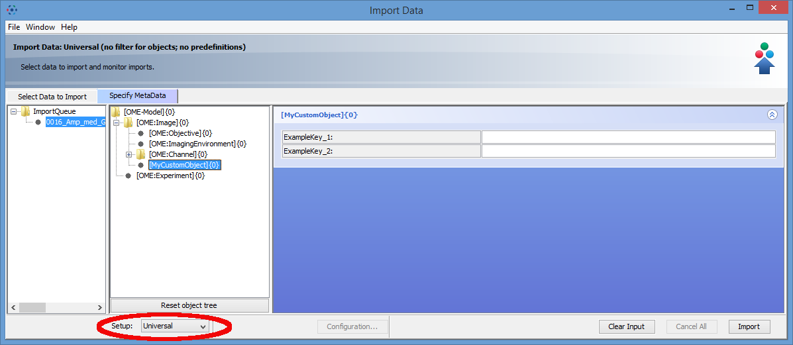
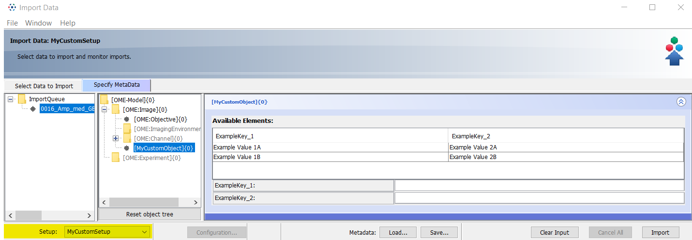

Predefine object values in OMERO.mde
====================================

**Description**
---------------

By using OMERO.mde you can generate a set of predefined values for the available objects. You can predefine different values for same objects by group it in setups.

**Step-by-Step**
----------------

#. Open the ``mdeConfiguration.xml`` file under ``<userHome>/omero/``.

#. Insert a new ``<SetupPre>`` element under ``<MDEPredefinitions>`` with the name of the setup for that you want to specify the values::

            <MDEConfiguration>
                <MDEPredefinitions>
                    <SetupPre Name="MyCustomSetup">
                </MDEPredefinitions>
            </MDEConfiguration>

#. Insert under this ``<SetupPre>`` element an ``<ObjectPre>`` element with the name of the object for that you want to specify the values::

            <MDEConfiguration>
                <MDEPredefinitions>
                    <SetupPre Name="MyCustomSetup">
                        <ObjectPre ID="" Type="MyCustomObject"/>
                    </SetupPre>
                </MDEPredefinitions>
            </MDEConfiguration>
        
#. Now you can copy - paste the object properties definied under <ObjectDef> for this object and then specify the Values.

NOTE: You can specify different predefined values for the same object by generate multi ``<ObjectPre>`` elements for this object. OMERO.mde than shows you a table of available Elements Predefinitions) for this object.

**Example**
-----------

Specification like::
        
                 <MDEConfiguration>
                    <MDEPredefinitions>
                        <SetupPre Name="MyCustomSetup">
                            <ObjectPre Type="MyCustomObject">
                                <TagData DefaultValues="" Name="ExampleKey_1" Type="TextField"
                                            Unit="" Value="Example Value 1A" Visible="true" />
                                <TagData DefaultValues="" Name="ExampleKey_2" Type="TextField"
                                            Unit="" Value="Example Value 2A" Visible="true" />
                            </ObjectPre>
                            <ObjectPre Type="MyCustomObject">
                                <TagData DefaultValues="" Name="ExampleKey_1" Type="TextField"
                                            Unit="" Value="Example Value 1B" Visible="true" />
                                <TagData DefaultValues="" Name="ExampleKey_2" Type="TextField"
                                            Unit="" Value="Example Value 2B" Visible="true" />
                            </ObjectPre>
                        </SetupPre>
                    </MDEPredefinitions>
                    <MDEObjects>
                        <Definitions>
                            ...
                            <ObjectDef Type="MyCustomObject">
                                <TagData DefaultValues="" Name="ExampleKey_1" Type="TextField"
                                           Unit="" Value="" Visible="true" />
                                <TagData DefaultValues="" Name="ExampleKey_2" Type="TextField"
                                           Unit="" Value="" Visible="true" />
                                <Parents Values="OME:Image" />
                            </ObjectDef>
                        </Definitions>
                        <Configuration>
                            <SetupConf Name="MyCustomSetup">
                                <ObjectConf Type ="OME:Image"/>
                                <ObjectConf Type="MyCustomObject"/>
                            </SetupConf>
                        </Configuration>
                    </MDEObjects>
                 </MDEConfiguration>

will create input form like

Setup:Universal
|mde_predefExample2_setup1|

Setup:MyCustomSetup
|mde_predefExample2_setup2|

