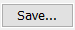
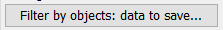
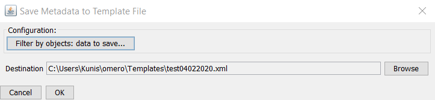
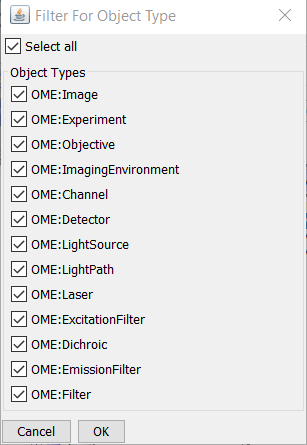
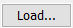
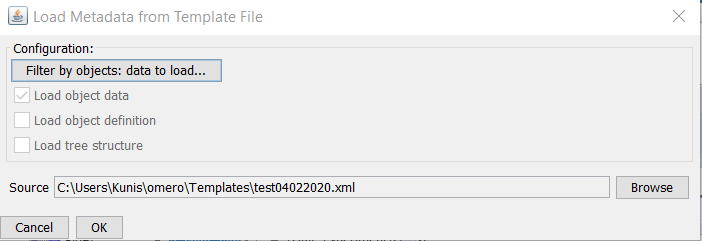
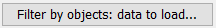

Use input templates for OMERO.mde
=================================

** only available from OMERO.insight v5.5.11**
You can save your inputs for MDE objects in a template file for reused the inputs for another import.

Step-by-Step
------------

**Save input:**

#. Start OMERO.importer and login.

#. Select your files for import and add it to the queue.

#. Click on the MDE Button |mde_button1| at the right bottom pane.

#. Add your inputs.

#. Select in the middle bottom pane |mde_SaveTemp| to get the *Save Template* dialog

    |mde_SaveTemplDialog|

#. Select the object types for which the input should be saved. To do this press the button |mde_SaveTempl_filterObj| and select the types.

#. Choose the location and file name for your template file.

#. Press ok to save the file.

**Loading the template file for another import:**

#. In the MDE Pane select the dir or file for which the input should load.

#. Select in the middle bottom pane |mde_LoadTemp| to get the *Load Template* dialog

    |mde_LoadTemplDialog|

#. Select the object types for which the input should be loaded. To do this press the button |mde_LoadTempl_filterObj| and select the types.

#. Choose the location and file name of your template file.

#. Press ok to load the values.

.. |mde_button1| image:: images/mde_button1.png
        :width: 0.6in
        :height: 0.2in
